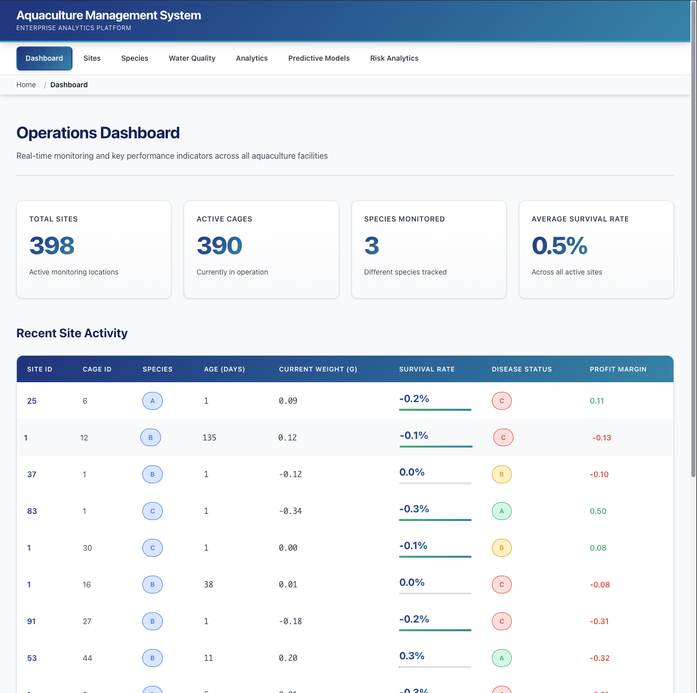
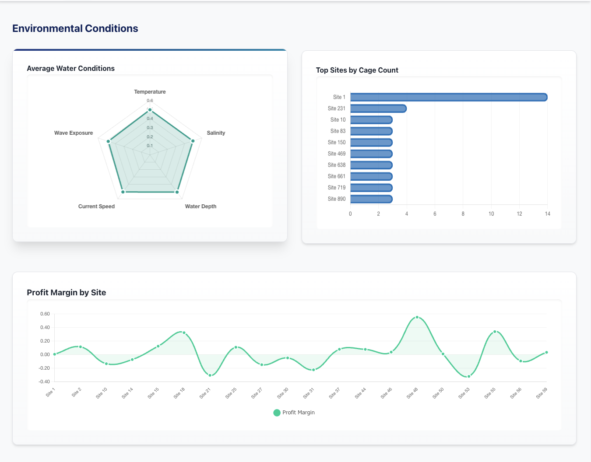
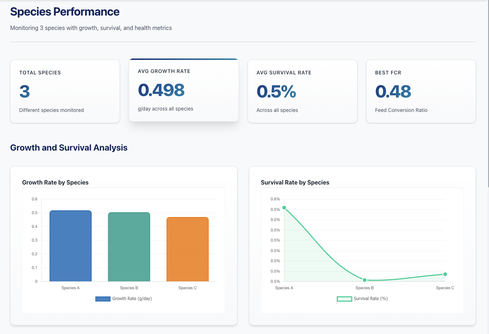
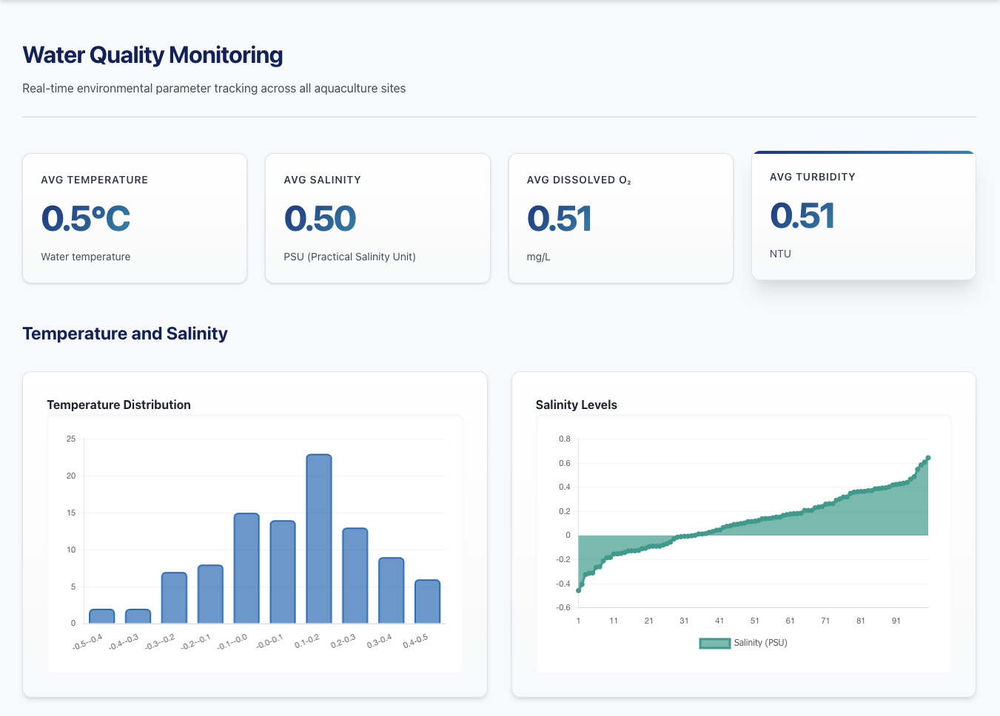
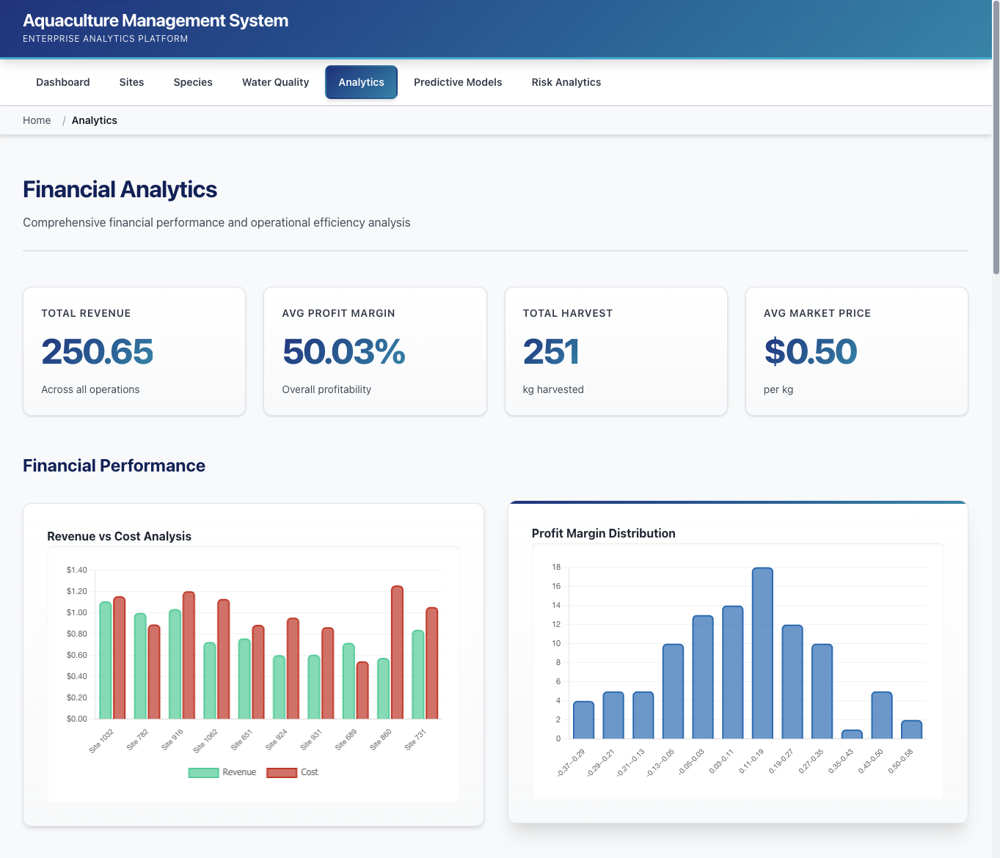
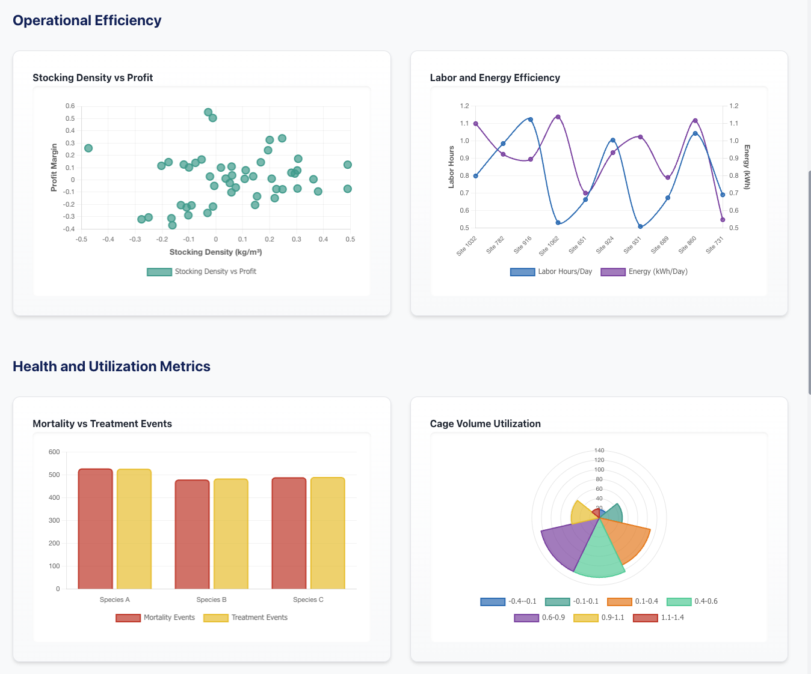
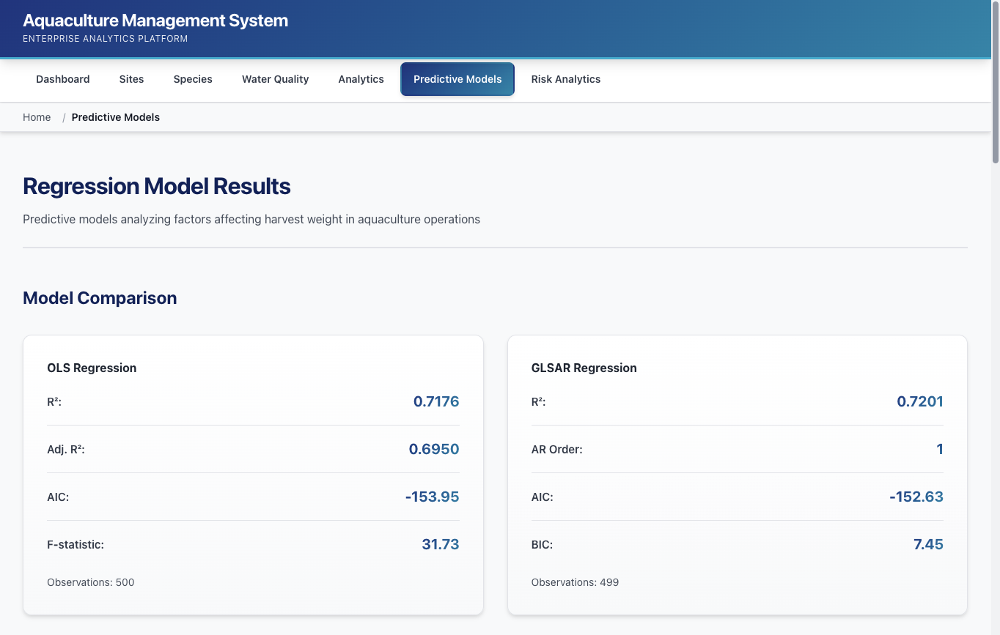
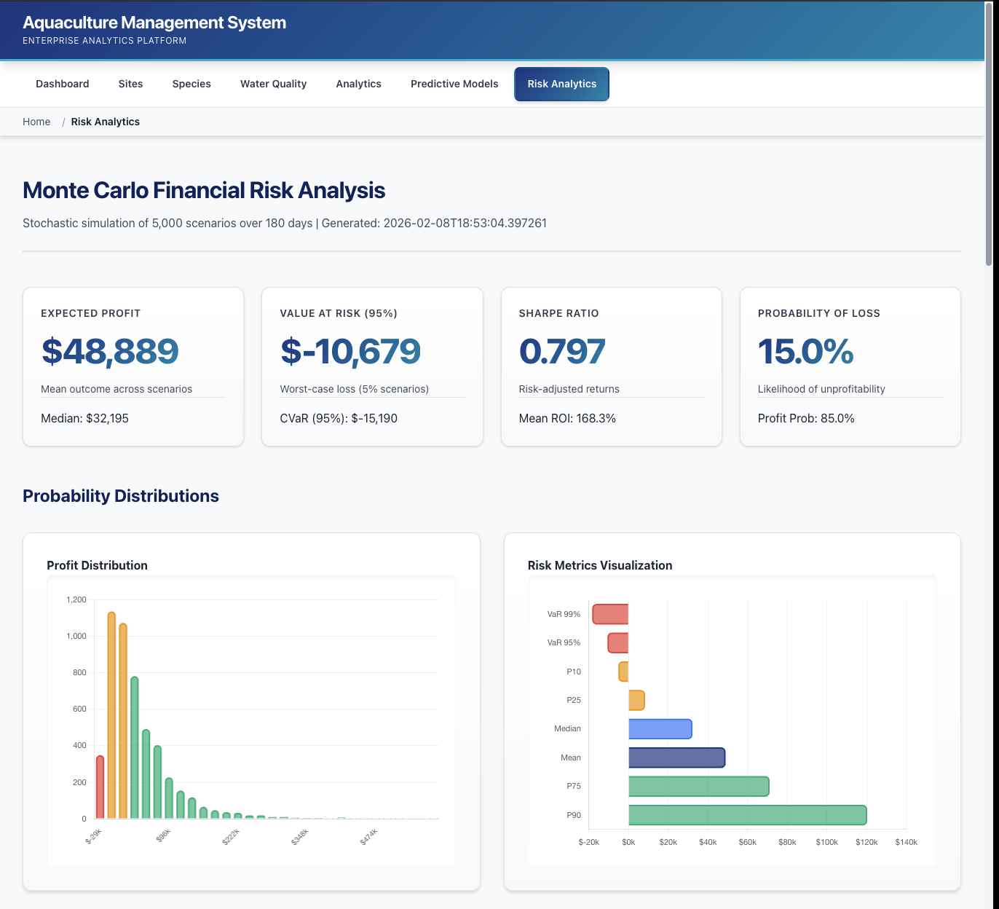
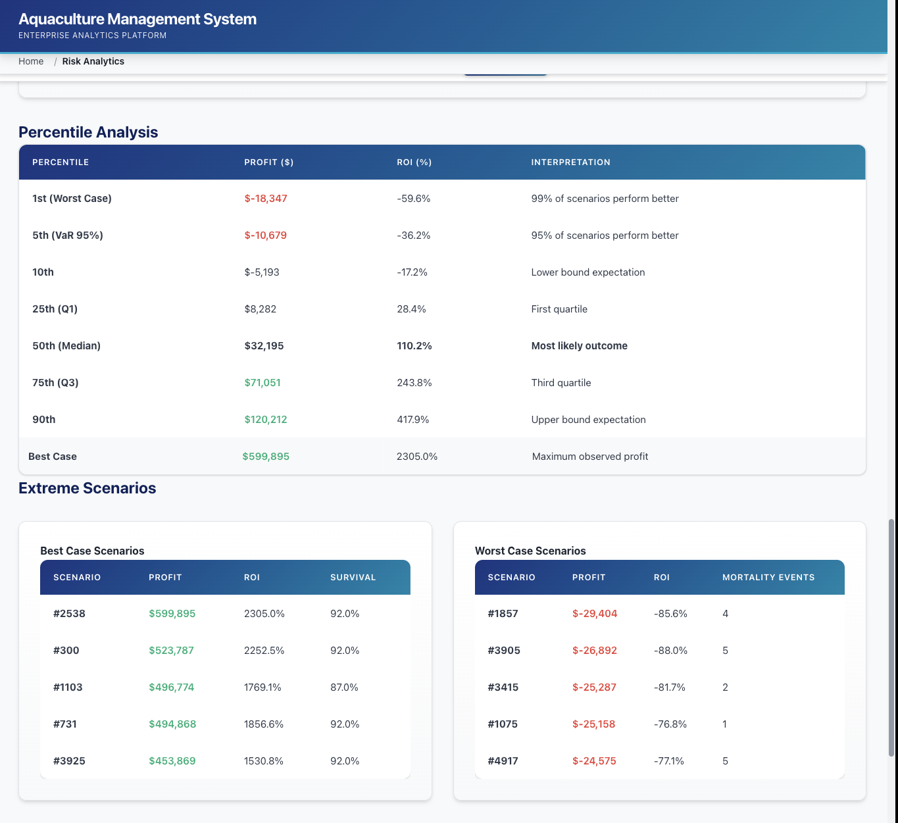

<div align="center">
  
</div>

<div align="center">


</div>

---

## Overview

Enterprise-grade aquaculture management platform featuring advanced statistical modeling, Monte Carlo risk simulation, and comprehensive operational analytics. Built for data-driven decision-making in commercial aquaculture operations.

## Key Features

### Financial Analytics
- Revenue and cost tracking across all operations
- Profit margin analysis by site, species, and regulatory zone
- Market price trend analysis
- ROI optimization with Monte Carlo simulation

### Statistical Modeling
- OLS and GLSAR regression analysis for harvest weight prediction
- Comprehensive hypothesis testing (ANOVA, Kruskal-Wallis, Mann-Whitney U)
- Correlation analysis (Pearson, Spearman, Kendall)
- Distribution fitting (Normal, Lognormal, Gamma)

### Risk Management
- Monte Carlo simulation with 5,000+ scenarios
- Value at Risk (VaR) and Conditional VaR (CVaR) calculations
- Sharpe ratio analysis for risk-adjusted returns
- Stochastic modeling with Geometric Brownian Motion, Jump-Diffusion, and Ornstein-Uhlenbeck processes

### Operational Intelligence
- Real-time water quality monitoring
- Species performance tracking
- Site clustering and segmentation
- Growth curve modeling (Von Bertalanffy, Logistic, Gompertz)
- Mortality peak detection using signal processing

### Data Visualization
- 30+ interactive Chart.js visualizations
- Distribution histograms and scatter plots
- Cumulative distribution functions (CDF)
- Correlation heatmaps
- Time series analysis

## Technology Stack

### Backend
- **Flask 3.1.2** - Web application framework
- **Python 3.12+** - Core programming language
- **Jinja2 3.1.6** - Template engine

### Data Science & Analytics
- **NumPy 2.4.2** - Numerical computing
- **Pandas 3.0.0** - Data manipulation and analysis
- **SciPy 1.17.0** - Scientific computing and statistics
- **statsmodels 0.14.6** - Statistical modeling (OLS, GLSAR)
- **Matplotlib 3.10.8** - Plotting and visualization
- **Seaborn 0.13.2** - Statistical data visualization

### Frontend
- **Chart.js 4.4.0** - Interactive charts
- **Vanilla JavaScript** - Client-side interactivity
- **CSS3** - Professional UI design system

### Mathematical Libraries
- **patsy 1.0.2** - Statistical formula notation
- **python-dateutil 2.9.0** - Date/time utilities

## Installation

### Prerequisites
- Python 3.12 or higher
- pip package manager
- Virtual environment (recommended)

### Setup

1. Clone the repository:
```bash
git clone https://github.com/Mojeda01/Aquaculture-Management-System.git
cd aquaculture-management-system
```

2. Create and activate virtual environment:
```bash
python -m venv venv
source venv/bin/activate  # On Windows: venv\Scripts\activate
```

3. Install dependencies:
```bash
pip install -r requirements.txt
```

4. Run the application:
```bash
python app.py
```

5. Access the dashboard:
```
http://localhost:5000
```

## Project Structure

```
aquaculture-management-system/
├── app.py                          # Flask application entry point
├── requirements.txt                # Python dependencies
├── models/                         # Statistical models and results
│   ├── ols_results.json           # OLS regression output
│   ├── glsar_results.json         # GLSAR regression output
│   └── monte_carlo_results.json   # Risk simulation results
├── src/
│   ├── stats/
│   │   ├── scipy_analysis.py      # Comprehensive statistical analysis
│   │   └── scipy_insights.py      # Simplified insights module
│   └── templates/                  # HTML templates
│       ├── index.html             # Dashboard
│       ├── sites.html             # Site management
│       ├── species.html           # Species performance
│       ├── water-quality.html     # Environmental monitoring
│       ├── analytics.html         # Financial analytics
│       ├── model-results.html     # Regression models
│       └── risk-analytics.html    # Monte Carlo risk analysis
├── static/
│   ├── css/
│   │   └── style.css              # Enterprise design system
│   └── js/
│       ├── charts.js              # Site visualizations
│       ├── species-charts.js      # Species charts
│       ├── water-quality-charts.js # Environmental charts
│       ├── analytics-charts.js    # Financial charts
│       ├── model-charts.js        # Regression charts
│       └── risk-charts.js         # Risk analytics charts
├── data/
│   └── aquaculture_dataset.json   # Primary dataset (21,501 records)
└── logos/                          # Brand assets
    └── title_logo.png             # Application logo
```

## Statistical Analyses

### Hypothesis Testing
- **ANOVA**: Compare species performance across groups
- **Kruskal-Wallis**: Non-parametric alternative for non-normal distributions
- **Mann-Whitney U**: Pairwise species comparisons
- **Effect Size**: Eta-squared for practical significance

### Correlation Analysis
- **Pearson**: Linear relationships between variables
- **Spearman**: Monotonic relationships (rank-based)
- **Kendall's Tau**: Robust correlation measure

### Distribution Analysis
- **Shapiro-Wilk**: Test for normality
- **Anderson-Darling**: Alternative normality test
- **Kolmogorov-Smirnov**: Goodness-of-fit testing
- **Skewness & Kurtosis**: Distribution shape analysis

### Optimization
- **Stochastic Optimization**: Find optimal operating conditions
- **Constrained Optimization**: Maximize profit within operational bounds
- **Polynomial Fitting**: Model complex relationships

### Clustering
- **Hierarchical Clustering**: Group similar sites using Ward linkage
- **Performance Segmentation**: Classify sites into Elite/Average/Needs Improvement tiers

### Time Series
- **Peak Detection**: Identify critical mortality periods using signal processing
- **Trend Analysis**: Detect patterns in operational data

## Dataset

- **Total Records**: 21,501 observations
- **Sites**: 398 unique locations
- **Species**: 3 monitored species (A, B, C)
- **Variables**: 40+ features including environmental, operational, and financial metrics

### Key Metrics
- Water quality parameters (temperature, salinity, dissolved oxygen, pH, ammonia, nitrate)
- Production metrics (growth rate, survival rate, feed conversion ratio)
- Financial data (revenue, costs, profit margins, market prices)
- Operational data (stocking density, labor hours, energy consumption)

## API Endpoints

| Endpoint | Description |
|----------|-------------|
| `/` | Main dashboard with KPIs |
| `/sites` | Site management and environmental analysis |
| `/species` | Species performance tracking |
| `/water-quality` | Environmental monitoring dashboard |
| `/analytics` | Financial analytics and profitability |
| `/model-results` | OLS and GLSAR regression results |
| `/risk-analytics` | Monte Carlo risk simulation |

## Screenshots

<div align="center">

### Dashboard Overview


### Site Management


### Species Performance


### Water Quality Monitoring


### Financial Analytics


### Predictive Models


### Risk Analytics


### Statistical Insights


### Advanced Visualizations


</div>

## Contributing

Contributions are welcome. Please follow these guidelines:

1. Fork the repository
2. Create a feature branch (`git checkout -b feature/new-analysis`)
3. Commit changes (`git commit -m 'Add new statistical analysis'`)
4. Push to branch (`git push origin feature/new-analysis`)
5. Open a Pull Request

## License

This project is licensed under the MIT License - see the LICENSE file for details.

## Acknowledgments

- Built with Flask and modern data science libraries
- Statistical methods based on industry-standard practices
- Monte Carlo simulation framework adapted from quantitative finance methodologies
- UI/UX design inspired by enterprise SaaS platforms

## Contact

For questions, feature requests, or support, please open an issue in the repository.

---

<div align="center">

**Aquaculture Management System** | Enterprise Analytics Platform

Built with Python, Flask, NumPy, Pandas, SciPy, and statsmodels

</div>
